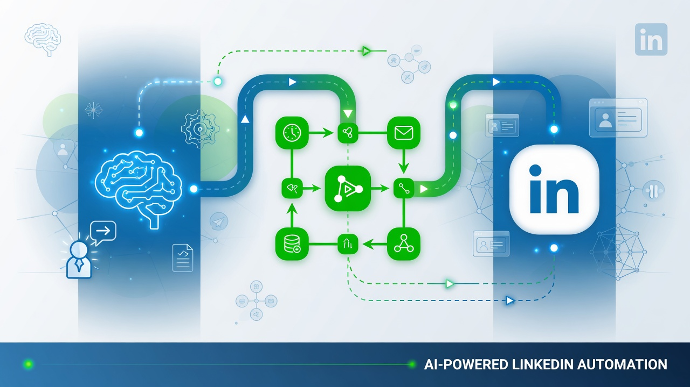
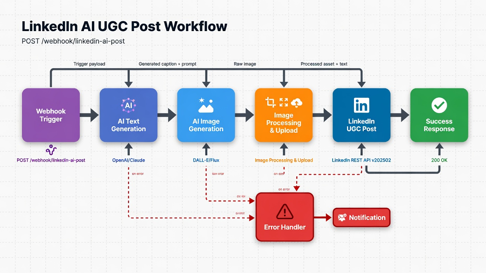
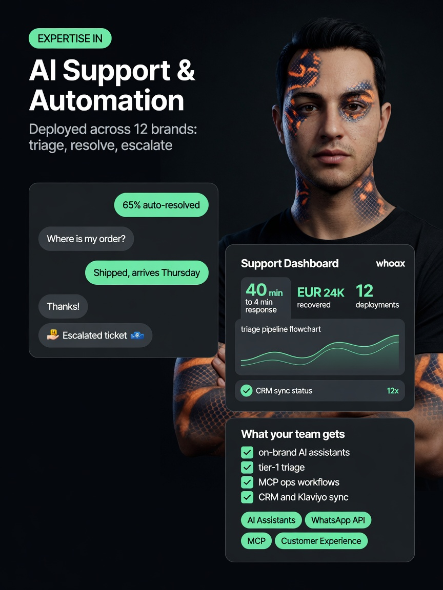
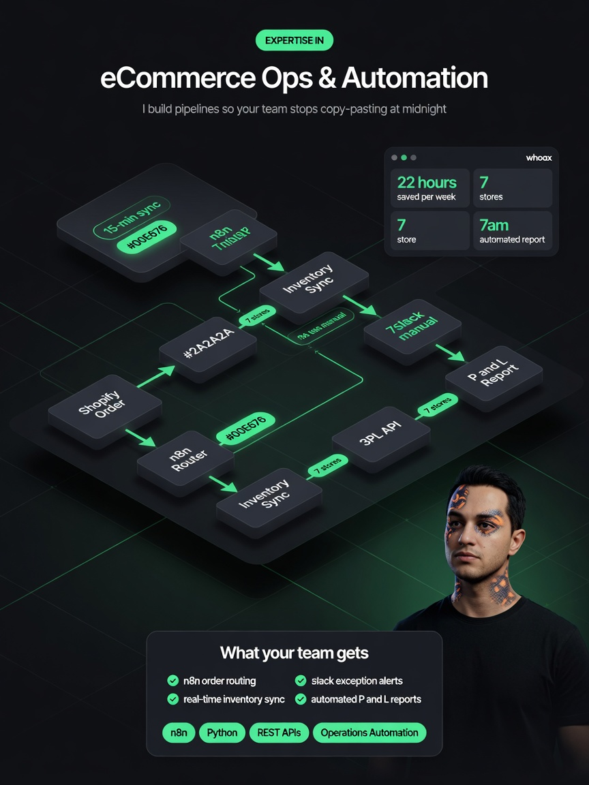
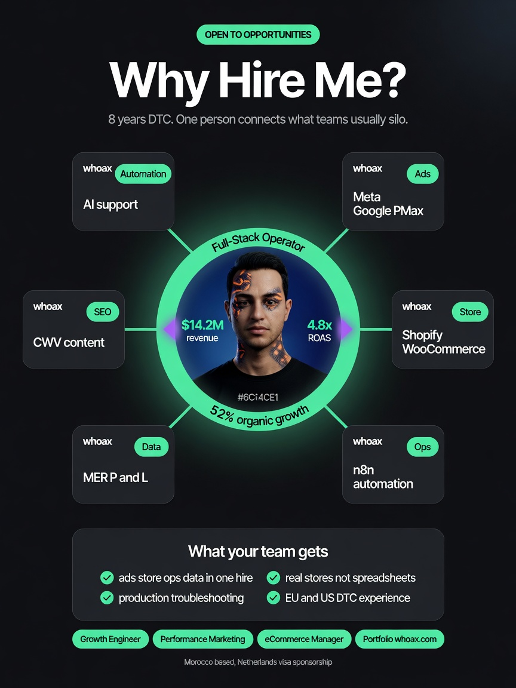
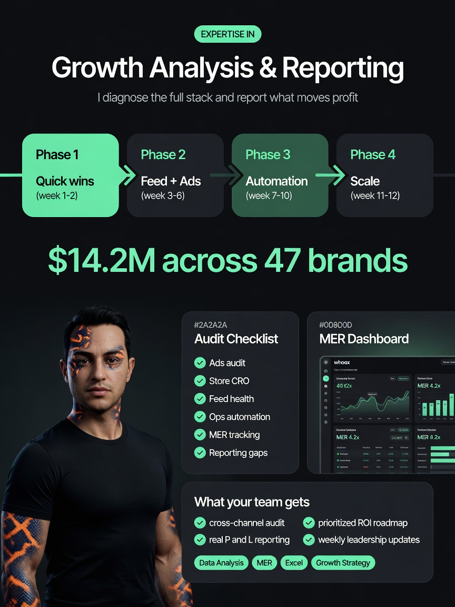

# n8n AI LinkedIn Poster | Automate AI-Generated Posts with Images & Captions

> Production-ready n8n workflow to generate & auto-publish AI-powered LinkedIn posts with stunning images and engaging captions. Trigger instantly from Claude, Cursor, Devin, or any AI assistant via webhook. Fully documented, self-hostable, and customizable.

[](https://n8n.io/)
[](LICENSE)
[](https://learn.microsoft.com/en-us/linkedin/marketing/)
[](docker-compose.yml)
[](CONTRIBUTING.md)

**Keywords:** n8n workflow LinkedIn · AI generated LinkedIn posts · n8n webhook Claude Cursor Devin · automate LinkedIn posting with AI images · social media automation open source

> **🔐 Bring your own credentials.** This repo contains **no API keys, no OAuth tokens, and no personal IDs**. You create your own [LinkedIn Developer App](docs/linkedin-developer-app.md), connect your own n8n credentials, and post to your own profile. See the [credentials guide](docs/linkedin-developer-app.md).

---

## Quick Start

Get from zero to preview in under 10 minutes:

1. **Clone & start n8n**
   ```bash
   git clone https://github.com/Ai-assistant-KIRA/n8n-ai-linkedin-poster.git
   cd n8n-ai-linkedin-poster
   docker compose up -d
   ```

2. **Create your LinkedIn Developer App** — Follow [docs/linkedin-developer-app.md](docs/linkedin-developer-app.md) to create an app, get Client ID/Secret, and connect OAuth in n8n

3. **Import the workflow** — Open `http://localhost:5678` → **Import** → `workflows/linkedin-ai-poster.json` → assign **your** OpenAI + LinkedIn credentials → **Activate**

4. **Set your Person ID** — Get your OpenID `sub` from `/v2/userinfo` and add `LINKEDIN_PERSON_ID` to `docker-compose.yml` ([guide](docs/setup.md#get-your-linkedin-person-urn))

5. **Preview your first post**
   ```bash
   curl -X POST http://localhost:5678/webhook/linkedin-ai-post \
     -H "Content-Type: application/json" \
     -d '{"topic": "How AI agents transform automation workflows", "dry_run": true}'
   ```

Set `"dry_run": false` when you're ready to publish. Full guide → [docs/setup.md](docs/setup.md)

---

## Features

- 🤖 **Full AI pipeline** — Generate captions (GPT-4o-mini) and images (DALL-E 3) from a single topic
- 🔗 **Webhook-first** — One `POST` from Claude, Cursor, Devin, ChatGPT, or any HTTP client
- 🖼️ **Native LinkedIn images** — REST API v202502 image upload + UGC post (no brittle scraping)
- ✍️ **Flexible input** — Topic-only, custom caption, image URL, or full control
- 👀 **Preview mode** — `dry_run: true` generates content without publishing
- 🔌 **Provider-agnostic** — Swap OpenAI for Anthropic, Azure, Replicate, or local models
- 🐳 **Self-hostable** — Docker Compose included; works on n8n Cloud too
- 📚 **Battle-tested docs** — Setup, config, integrations, and troubleshooting guides
- 🔓 **100% open source** — MIT licensed, no vendor lock-in, no personal data baked in

---

## How It Works



```
Webhook → Parse Input → AI Caption? → AI Image? → LinkedIn Upload → Create Post → Response
                              ↓ dry_run: true
                         Preview JSON (no publish)
```

| Step | Node | What happens |
|------|------|--------------|
| 1 | **Webhook Trigger** | Receives JSON from your AI assistant |
| 2 | **Parse Webhook Input** | Normalizes topic, caption, image_prompt, dry_run |
| 3 | **AI Generate Caption** | LLM writes a high-performing LinkedIn post (optional) |
| 4 | **AI Generate Image** | DALL-E creates a feed-native visual (optional) |
| 5 | **LinkedIn Init Upload** | Gets signed upload URL from LinkedIn REST API |
| 6 | **LinkedIn Upload Image** | PUT binary image to LinkedIn CDN |
| 7 | **LinkedIn Create Post** | Publishes UGC post with image + commentary |
| 8 | **Respond to Webhook** | Returns `shareUrl`, `postUrn`, and metadata |

Deep dive → [docs/usage.md](docs/usage.md) · Customize → [docs/configuration.md](docs/configuration.md)

---

## ✨ Live Example Posts

These are **real posts** published with this workflow. Images and links below are from the maintainer's profile — your fork will publish to **your** LinkedIn account once you add your own credentials.

[View all posts on LinkedIn →](https://www.linkedin.com/in/reda-alaarabi-b47602359/recent-activity/all/)

| Theme | Preview | Live post | Why it performs |
|-------|---------|-----------|-----------------|
| AI Agents & Automation |  | [View post](https://www.linkedin.com/feed/update/urn:li:share:7473856365413879809/) | Problem → solution framing; AI triage angle drives saves |
| No-Code / n8n Automation |  | [View post](https://www.linkedin.com/feed/update/urn:li:share:7473856027965206528/) | Relatable ops pain point; concrete automation wins |
| Future of Work |  | [View post](https://www.linkedin.com/feed/update/urn:li:share:7473857809357443073/) | Open-to-work + operator philosophy; high comment rate |
| Industry Insights |  | [View post](https://www.linkedin.com/feed/update/urn:li:share:7473857056161292288/) | Data-visual creative + diagnose-before-spend hook |

Full post index → [examples/published-posts.json](examples/published-posts.json) (12 live URLs)

> Fork users: replace these with your own posts after publishing, or [submit examples via PR](CONTRIBUTING.md#submitting-example-post-screenshots).

---

## AI Assistant Skill (install in 30 seconds)

This repo includes a ready-to-use **AI skill** so assistants know exactly how to preview and publish posts:

```
skills/n8n-linkedin-poster/SKILL.md      ← main skill (Cursor, Claude, Grok, Codex)
.cursor/rules/n8n-linkedin-poster.mdc    ← Cursor rule (copy to your project)
```

**Install:**

| Platform | Command |
|----------|---------|
| **Cursor** | Copy `.cursor/rules/n8n-linkedin-poster.mdc` into your project |
| **Claude / Grok** | Copy `skills/n8n-linkedin-poster/` to `.grok/skills/` or `~/.claude/skills/` |
| **Claude Projects** | Upload `SKILL.md` + `prompts/linkedin-content-system-prompt.md` as knowledge |

Full install guide → [skills/n8n-linkedin-poster/references/install.md](skills/n8n-linkedin-poster/references/install.md)

## AI Assistant Integrations

Trigger posts from the tools you already use:

| Platform | Guide | One-liner |
|----------|-------|-----------|
| **Claude** | [docs/integrations/claude.md](docs/integrations/claude.md) | Add webhook URL to Project instructions |
| **Cursor** | [docs/integrations/cursor.md](docs/integrations/cursor.md) | Use included `.cursor/rules/` + skill |
| **Devin** | [docs/integrations/devin-and-agents.md](docs/integrations/devin-and-agents.md) | Tool definition with `dry_run` default |
| **Any AI agent** | [docs/integrations/general-ai-assistants.md](docs/integrations/general-ai-assistants.md) | Webhook URL + JSON schema + system prompt |

**System prompt** → [prompts/linkedin-content-system-prompt.md](prompts/linkedin-content-system-prompt.md)  
**Example payloads** → [examples/webhook-payloads.json](examples/webhook-payloads.json)

---

## Webhook API

```
POST /webhook/linkedin-ai-post
```

```json
{
  "topic": "Your post topic",
  "tone": "professional",
  "hashtags": ["#AI", "#Automation"],
  "dry_run": true
}
```

| Field | Required | Description |
|-------|----------|-------------|
| `topic` | Yes* | Subject for AI generation |
| `caption` | No | Skip AI caption if provided |
| `image_prompt` | No | Custom image generation prompt |
| `image_url` | No | Use existing image instead of AI |
| `dry_run` | No | `true` = preview only (recommended first) |

\* Not required if `caption` + `image_url` are both provided.

---

## Documentation

| Doc | Description |
|-----|-------------|
| [**LinkedIn Developer App**](docs/linkedin-developer-app.md) | **Start here** — create your app, OAuth, credentials (BYO) |
| [Setup Guide](docs/setup.md) | Docker, n8n import, Person URN, webhook URL |
| [Configuration](docs/configuration.md) | Prompts, tone, hashtags, image style, AI providers |
| [Usage](docs/usage.md) | Webhook schema, preview/publish flow, scheduling |
| [Troubleshooting](docs/troubleshooting.md) | 401/403/422 fixes, image upload, Person ID |
| [Contributing](CONTRIBUTING.md) | PR guidelines, example submissions |

---

## Project Structure

```
n8n-ai-linkedin-poster/
├── README.md
├── LICENSE
├── CONTRIBUTING.md
├── docker-compose.yml
├── workflows/
│   └── linkedin-ai-poster.json
├── docs/
│   ├── setup.md
│   ├── configuration.md
│   ├── usage.md
│   ├── troubleshooting.md
│   └── integrations/
│       ├── claude.md
│       ├── cursor.md
│       ├── devin-and-agents.md
│       └── general-ai-assistants.md
├── assets/
├── examples/
│   └── webhook-payloads.json
├── prompts/
│   └── linkedin-content-system-prompt.md
├── skills/
│   └── n8n-linkedin-poster/
│       ├── SKILL.md
│       └── references/
├── .cursor/
│   └── rules/
│       └── n8n-linkedin-poster.mdc
└── .github/
    └── PULL_REQUEST_TEMPLATE.md
```

---

## FAQ

<details>
<summary><strong>Do I need a LinkedIn Premium account?</strong></summary>

No. A free LinkedIn account with an approved Developer App is sufficient for personal profile posting.
</details>

<details>
<summary><strong>Can I post to a Company Page?</strong></summary>

This workflow targets personal profiles (`urn:li:person:`). Company Page posting requires `w_organization_social` scope and an organization URN — community contributions welcome!
</details>

<details>
<summary><strong>Which AI models are supported?</strong></summary>

OpenAI (GPT-4o-mini + DALL-E 3) ships by default. Swap nodes for Anthropic, Azure OpenAI, Gemini, Replicate, or any HTTP-compatible provider. See [docs/configuration.md](docs/configuration.md).
</details>

<details>
<summary><strong>Is localhost webhook enough for Claude/Cursor?</strong></summary>

Claude cloud needs a public URL. Use ngrok, Cloudflare Tunnel, n8n Cloud, or a VPS. Cursor running locally can hit `localhost:5678` directly.
</details>

<details>
<summary><strong>How do I avoid accidental publishes?</strong></summary>

Always default to `dry_run: true` in your AI assistant instructions. Only set `false` on explicit user confirmation.
</details>

<details>
<summary><strong>What about LinkedIn rate limits?</strong></summary>

Stay well under ~150 posts/day for personal profiles. Add queuing for high-volume use. Respect [LinkedIn API Terms](https://www.linkedin.com/legal/l/api-terms-of-use).
</details>

---

## Roadmap

- [ ] Company Page posting support
- [ ] Built-in scheduling queue (n8n Data Store)
- [ ] Carousel / multi-image posts
- [ ] Slack/Discord notification on publish
- [ ] Pre-built Claude Project + Cursor rule templates in repo
- [ ] Video thumbnail + document post support
- [ ] Community prompt pack (vertical-specific templates)

Have an idea? [Open an issue](https://github.com/Ai-assistant-KIRA/n8n-ai-linkedin-poster/issues) or submit a PR!

---

## Contributing

We love contributions! See [CONTRIBUTING.md](CONTRIBUTING.md) for guidelines. Whether it's a bug fix, new AI provider integration, or an example post screenshot — all welcome.

---

## License

[MIT](LICENSE) — use freely, commercially or personally.

---

## Star History

If this project saves you time, **give it a ⭐** — it helps the n8n and AI automation community discover it.

**[⭐ Star this repo](https://github.com/Ai-assistant-KIRA/n8n-ai-linkedin-poster)** · **[🐛 Report an issue](https://github.com/Ai-assistant-KIRA/n8n-ai-linkedin-poster/issues)** · **[🔀 Fork & customize](https://github.com/Ai-assistant-KIRA/n8n-ai-linkedin-poster/fork)**

---

<p align="center">
  <sub>Built with ❤️ for the n8n + AI automation community</sub>
</p>